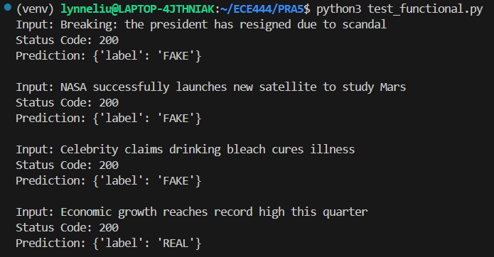
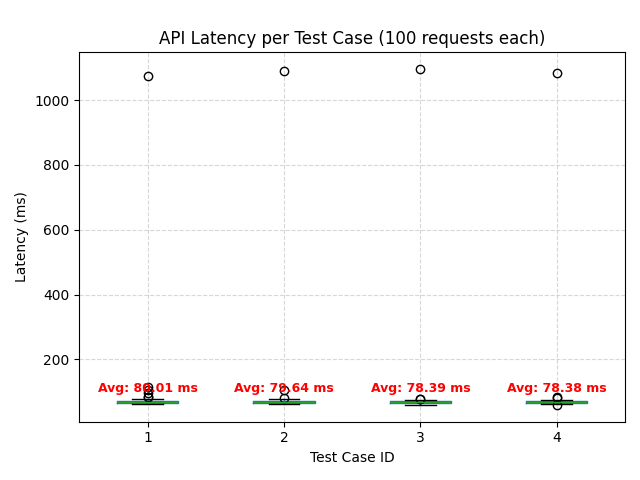

# Fake News Detection API — ECE444 PRA5

This repository contains a minimal **fake news classifier API** built with Flask and deployed on **AWS Elastic Beanstalk**.  
A pre-trained model (`basic_classifier.pkl`) and matching `CountVectorizer` are loaded to predict whether an input sentence is labeled as *FAKE* or *REAL*.  
The goal of this PRA is to demonstrate end-to-end deployment, basic API design, and simple latency evaluation.

## AWS Environment

The trained fake news classifier was deployed using **AWS Elastic Beanstalk**, which automatically manages EC2 instances, load balancing, and health monitoring for the Flask web service.

| **Item** | **Details** |
|-----------|-------------|
| **Cloud Provider** | Amazon Web Services (AWS) |
| **Service** | Elastic Beanstalk (auto-managed EC2 + Load Balancer) |
| **Platform** | Python 3.13 running on 64-bit Amazon Linux 2023 |
| **Deployment Package** | `PRA5-Deployment.zip` |
| **Start Command (Procfile)** | `web: gunicorn application:application` |
| **Demo Page** | `/demo` — simple web interface for text classification |
| **Environment Type** | Web Server Environment |
| **Region** | US East (Ohio) — `us-east-2` |

## Testing Results

Deployed website:

http://serve-sentiment-env.eba-fkss5nn8.us-east-2.elasticbeanstalk.com/demo

### Functional Test
| Input | Prediction |
|--------|-------------|
| Breaking: the president has resigned amid scandal | FAKE |
| NASA successfully launches new satellite to study Mars | FAKE |
| Celebrity claims drinking bleach cures disease | FAKE |
| Stock market reaches record high after strong earnings | REAL |

### Latency Test

I performed latency testing on the deployed AWS Elastic Beanstalk Flask API.  
Each of the four test cases was sent 100 POST requests to the `/predict` endpoint.

**Results summary:**
- Average latency: ~80 ms   
- Performance consistent across all four test cases  

Overall, the deployed API demonstrates **stable and low-latency** responses suitable for lightweight ML inference workloads.

